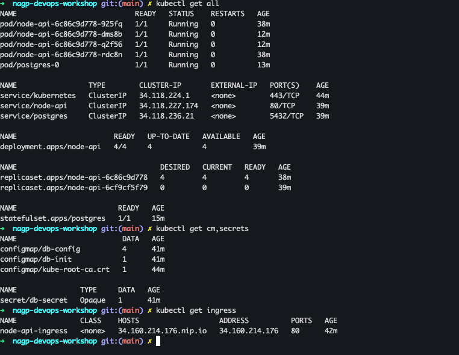
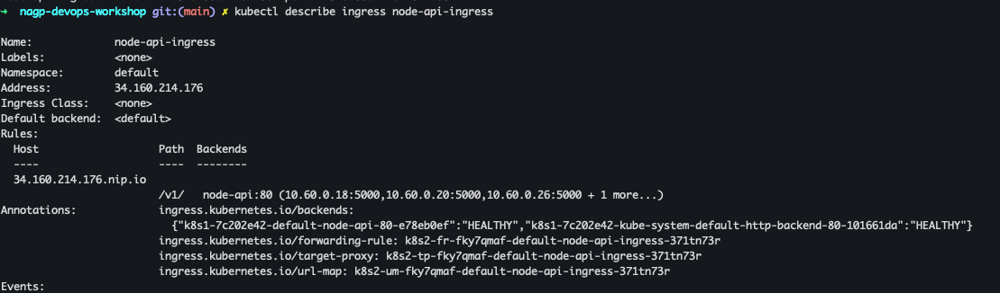
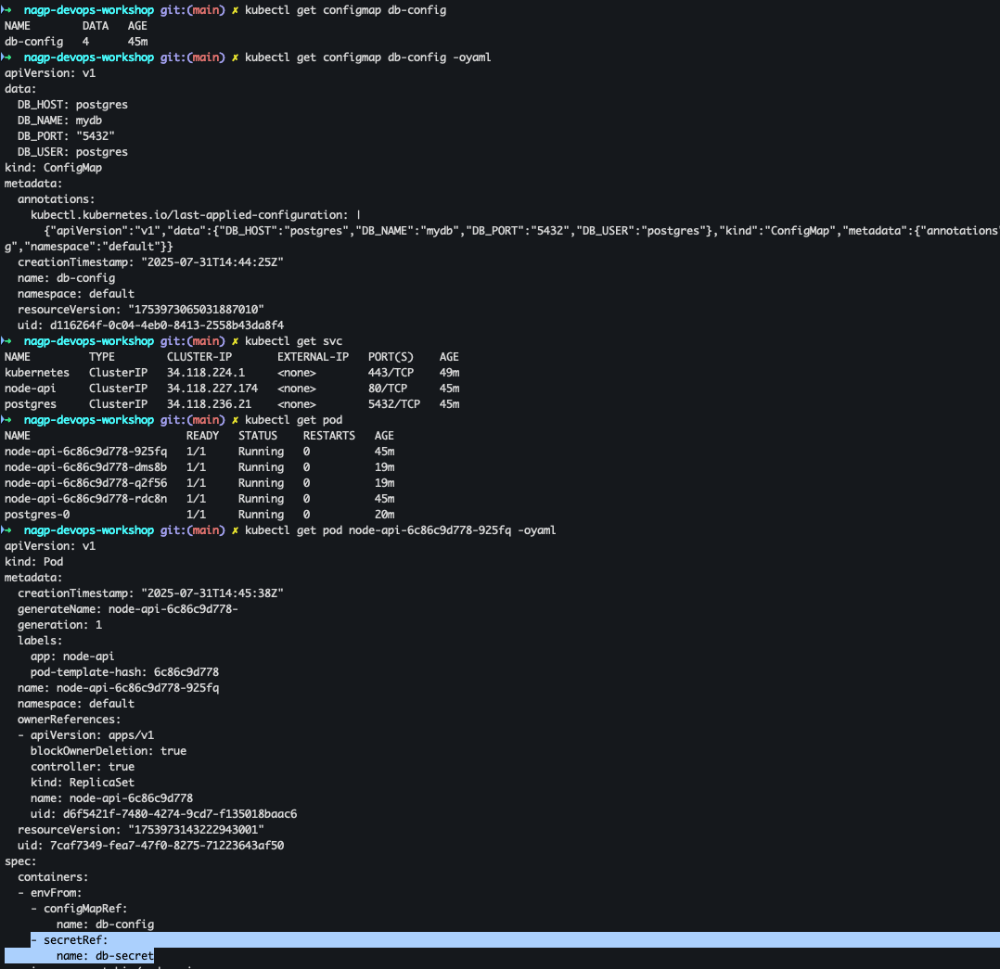
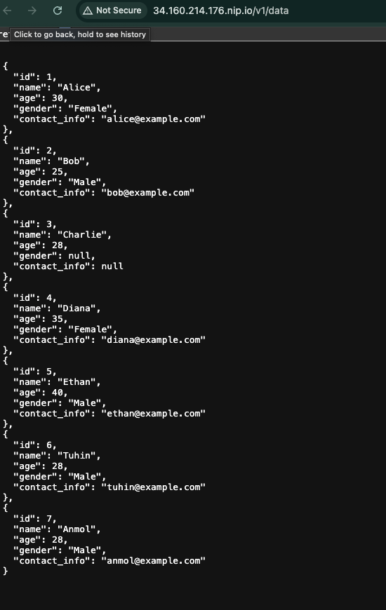
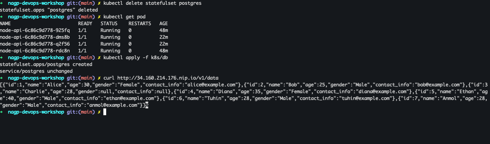
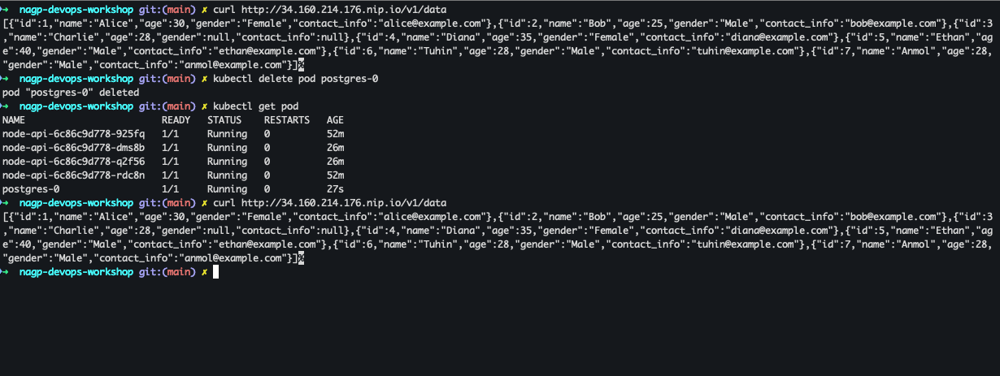
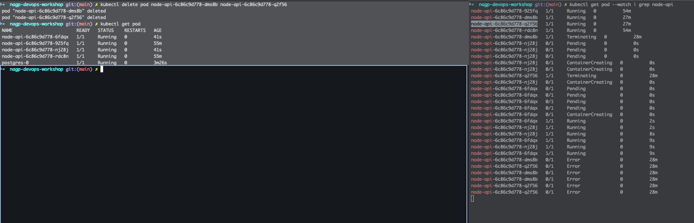

## 🔗 Project Links

- **GitHub Repository**: https://github.com/nagptuhin/nagp-devops-workshop
- **Docker Hub Image**: https://hub.docker.com/r/nagptuhin/node-api
- **Live API Endpoint**: http://34.160.214.176.nip.io/v1/data

## ✅ Requirement Understanding

- Create a multi-tier system on Kubernetes with:
  - One microservice (API) to expose data from a database.
  - One PostgreSQL database to store data.
- Use Kubernetes features like:
  - ConfigMap for configuration
  - Secrets for sensitive data
  - Persistent volume for DB
  - Ingress for external access
- Handle pod restarts with data persistence.

## ✅ Assumptions

- The user will access the API using Ingress Url/Host
- A single-node Kubernetes cluster is sufficient for demo purposes.
- PostgreSQL is used with default credentials and port.
- Sample data is loaded into the database on first startup using Configmap

## ✅ Solution Overview

- **Node.js API**: Connects to PostgreSQL using credentials from ConfigMap and Secret.
- **PostgreSQL DB**: Initialized with 5+ records via `init.sql`.
- **Dockerized**: Both app and database run as containers.
- **Kubernetes**:
  - API is deployed using `Deployment` + `Service`.
  - DB ise deployed using `StatefulSet` + `Service`.
  - `Ingress` exposes the API externally.
  - `PersistentVolumeClaim` ensures DB data is preserved.

## ✅ Justification for Resources Utilized

| Resource            | Reason                                                                 |
|---------------------|------------------------------------------------------------------------|
| Node.js + Express   | Lightweight, fast to develop, easy to deploy                          |
| PostgreSQL          | Reliable relational DB with easy init and setup                       |
| ConfigMap           | Clean separation of DB host, name, and user settings                  |
| Secret              | Secure handling of DB password                                         |
| PVC                 | Ensures DB retains data across pod restarts                           |
| Ingress             | Provides friendly external API access without exposing NodePorts      |

## ✅ Test Scenarios
    1. Show all components One-by-one
    
    2. Explain Ingress
    
    3. Explain mapping of Apptier to database.
    
    4. API call to show Data
    
    5. Delete the Statefulset and show data Persists
    
    5. Add a new entry To data - then delete the database POD - then show the Data persistance
    
    6. API POD delete and POD will recreate 
    